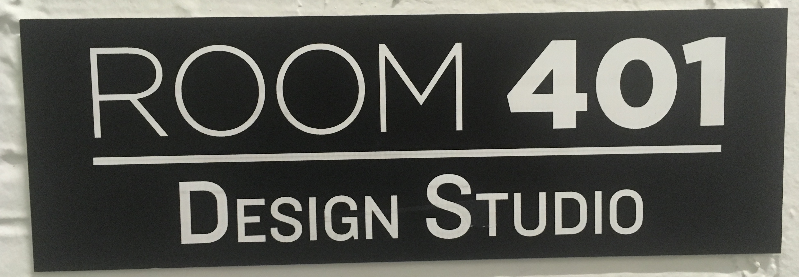
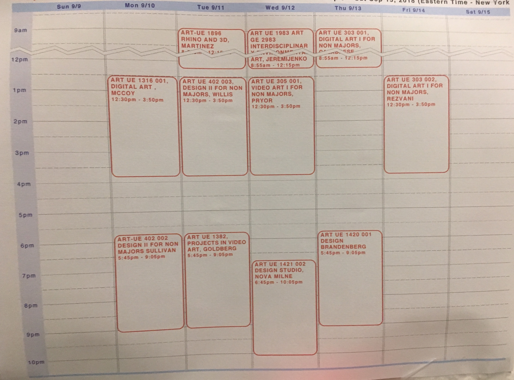
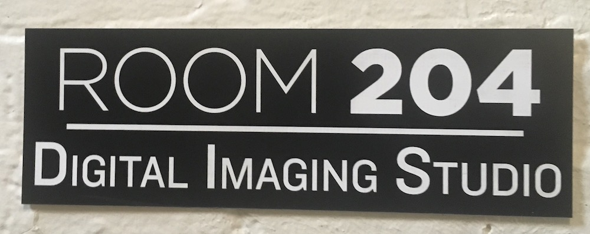
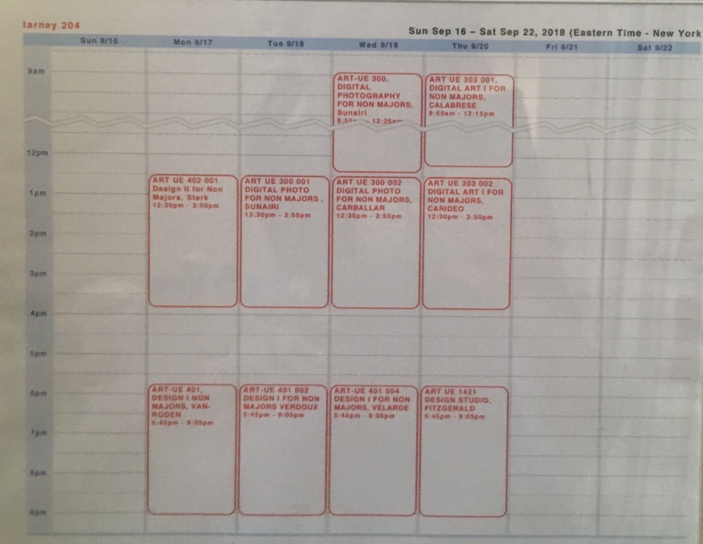

# NYU Computer Lab Info
NYU Computer Lab Resources
Fall 2018

There are **two computer labs** in the **Barney Building**:
**Room 204** & **Room 401** (our classroom)

*Open for student use in between classes:*

	

## NYU Computer Labs Choices in no particular order:
_In addition to the Barney Building, NYU has multiple computer labs with Photoshop available for student use. You may need to confirm schedules with each location as it is still the beginning of the semester and many places are still setting up staff schedules._

[Digital Studio](https://www.nyu.edu/life/information-technology/locations-and-facilities/digital-studio.html)
(Inside Bobst Library)
212-998-3333

[La Guardia Co-op](https://www.nyu.edu/life/information-technology/locations-and-facilities/student-technology-centers/laguardia-co-op.html)
541 LaGuardia Pl.
212-998-3427
[La Guardia Live Computer Availability Map](https://www.nyu.edu/life/information-technology/locations-and-facilities/student-technology-centers/laguardia-co-op-live-computer-map.html)

[Kimmel Center Lab](https://www.nyu.edu/life/information-technology/locations-and-facilities/student-technology-centers/kimmel-center-lab.html)
60 Washington Square South,
Room 409 (Solarium)
[Kimmel Live Computer Availability Map](https://www.nyu.edu/life/information-technology/locations-and-facilities/student-technology-centers/kimmel-center-live-computer-map.html)

[Third Ave Lab](https://www.nyu.edu/life/information-technology/locations-and-facilities/student-technology-centers/third-avenue-lab.html)
75 Third Avenue
12th Street Entrance
C3 Level (Sub Basement)
212-998-3501
[Third Ave Live Computer Availability Map](https://www.nyu.edu/life/information-technology/locations-and-facilities/student-technology-centers/third-avenue-live-computer-map.html)

### General Lab Info:
[Student Technology Centers](https://www.nyu.edu/life/information-technology/locations-and-facilities/student-technology-centers.html) (Includes the info above)

[Software Available by Location](https://www.nyu.edu/life/information-technology/getting-started/software/software-by-nyu-it-location.html)

[IT Locations Map](https://www.google.com/maps/d/u/0/viewer?mid=1ZoG3LYsjud0aD7B5msZwLB_OFA4&ll=40.73664071702436%2C-73.98440805000001&z=13)

Tags: #Ed_F18 #Ed_F18/NYU