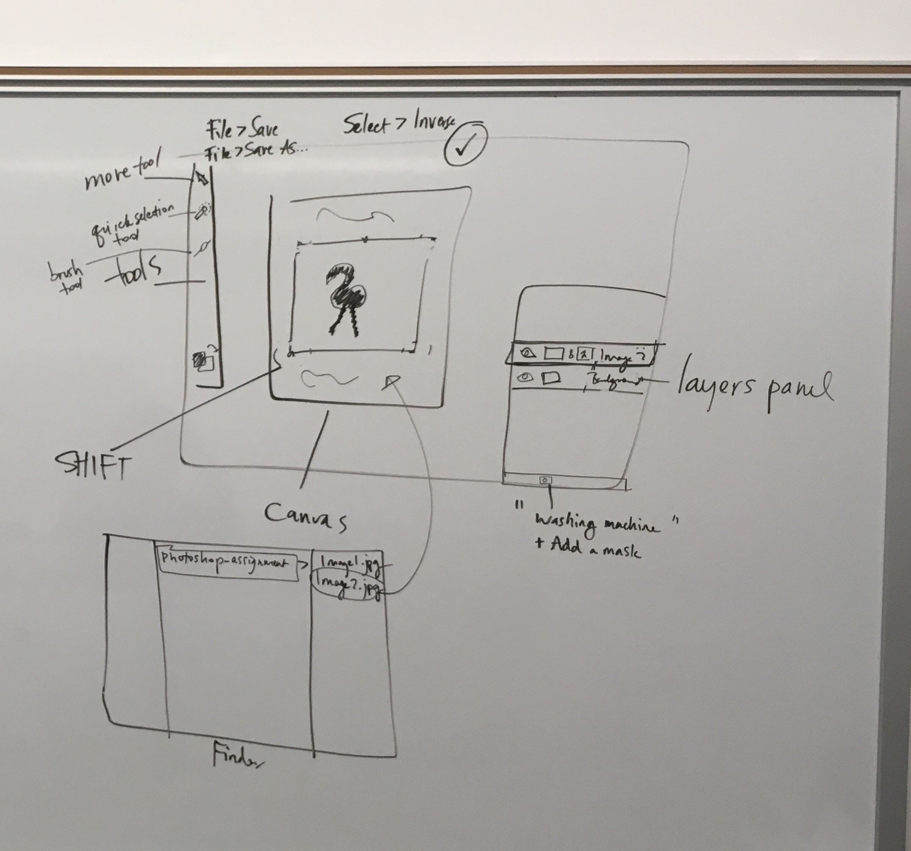

# NYU_wk1_LectureNotes
Supplemental Notes
NYU, wk 1
Friday, 9/7/2018

## Outline:
* Intros

* Intro to Photoshop

* Rastor v Vector

* Interface + keyboard shortcuts

* **Demo**:
  * Selecting Pixels
  * Isolating Layers
  * Adding a mask
  * Resizing images
  * Combining images

* **Homework**: due the day before Class 3 at 5pm _See the syllabus for more details._

* _Note: there will be time in class to do the homework. Please wait for further instructions in class on how to do this work and properly turn it in._

## General Operating System (OS) Keyboard Shortcuts:
- - - -
“Command + S” = save
“Command + C” = copy
“Command + V” = paste
“Command + TAB” = choose an open application
“Command + Z” = undo
_^For Photoshop:_
“Command + Option + Z” = undo more than one step

- - - -
_NOTE_: where Mac users say “Command” Windows users say “Control”. [very philosophical!] 

If you’re a Windows user, these keyboard shortcuts will work with a simple switch of those keys.
- - - -

## Opening a file in Photoshop
The same thing can be down in Photoshop in many ways. Opening files is no exception. Here are some options:
- - - -
(1) drag your file down to the photoshop icon in the dock, OR
- - - -
(2) drag your file into the already open photoshop interface, OR
- - - -
(3) in Photoshop, go to File > Open (“Command + O”), and browse and select your file.
- - - -
_PRO-TIP: The second option (above) is also a way to combine multiple images into one file._

## Zooming shortcuts
“Command” + “+” = Zoom in
- - - -
“Command” + “-” = Zoom out
- - - -
“Command + 0” = Zoom To fit to screen
- - - -
“SPACE BAR” + hold = hand tool

## Selecting pixels

- - - -
Once your have something in Photoshop, you’ll want to start with **selecting your pixels**. Below are some keyboard shortcuts for workflows we’ll go over to select pixels & do something with them.

### Photoshop shortcuts:
- - - -
“W” = magic wand tool
- - - -
“[“ or “]” = resize brush
- - - -
“Command + option + I” = inverse active selection
- - - -
“Command + J”= duplicate selected layer (or selected pixels in layer, if there is an active selection)
- - - -
“Command + D” = deselect any active selection [another helpful shortcut]
- - - -

### In-class demo (Part 1) Duplicating/isolating pixels into their own layer:
- - - -
(1) open the image of flowers included in the Class Resources folder in Blackboard using a method listed above.
- - - -
(2) Select the magic wand tool in the tool panel on the left
- - - -
(3) Click on the background of the image to select all the pixels in the background of the same color.
- - - -
(4) Inverse your selection by going to the menus at the top of the application: Select > Inverse. Now your flowers are selected (not your background).
- - - -
(5) With the flower pixels selected in the canvas and the flower layer selected in the layers panel, use the keyboard shortcut to duplicate the selected pixels in the selected layer into a new layer : Command + J.
- - - -
VOILA! The flower pixels are on their own layer.
- - - -

_Sometimes the above method is a great quick and dirty solution to getting & isolating the pixels you want to work with. But what if your selection wasn’t perfect before you moved those pixels to the new layer? Would you have to start all over again? This is one reason to use a “non-destructive” method of isolating your pixels. In other words, what if instead of moving the pixels we want into their own layer, we just hide the pixels we don’t want in a way that allows us to edit them? This is where Masks come in!_

## Masks
_A non-destructive way to hide pixels!_

### In class demo (Part II) Masking
- - - -
Follow the steps again to select the pixels you’d like to keep of just the flowers in your original flower layer. (Don’t forget to inverse your selection so you’ve selected the flowers, not the background). 
- - - -
Add a mask by hitting the “washing machine” icon at the bottom of the layers panel
- - - -
This will add a mask and hide any pixels in the current layer that weren’t selected when you clicked the button
- - - -
_Note: Adding a mask is a “non-destructive” way of hiding unwanted pixels. This means you can easily paint pixels back in, or paint more pixels out._
- - - -
To edit your mask to alter which pixels are hidden or showing, click on the mask thumbnail in the layers panel. Choose the Brush tool in the tool panel on the left (or by clicking “B”), and paint with white to show pixels or black to hide pixels.
- - - -
Click on the arrows to the top right of the foreground/background thumbnails at the bottom of the tools panel to switch between black & white or use the keyboard shortcut “X”
- - - -
Click on the bracket keys to resize your brush as you paint
- - - -
And lastly, you can choose to have a soft-edge or hard-edge brush once you’re already using that tool by clicking on the drop down arrow to the right of the brush icon at the top left of the control panel. Once you’ve opened the brush up, choose the percentage under “Hardness” for a soft or hard brush edge.
- - - -
VOILA! Again! You now have a layer with a mask that you can edit however you’d like.
- - - -

## Adding another image to your photoshop file
- - - -
Simply drag and drop your image onto the photoshop canvas to combine them into one file.
- - - -
Once you’ve dropped the new image into your file, Photoshop will automatically give you a “bounding box” allowing you to resize your image before committing it to the file. 
- - - -
_Note: See the notes below on resizing._
- - - -
Once you’ve resized your file you can reorder your layers in the layers panel by clicking and dragging the layers. Layers above others will cover any pixels below them.
- - - -

## Resize pixels
- - - -
With layer selected:
“Command + T” = Free Transform
_Note: when you drop images into Photoshop you can skip these first few steps_
- - - -
Using the above keyboard shortcut will give you a “bounding box” to allow you to resize the pixels in whatever layer you have selected
- - - -
**PRO-TIP: ALWAYS HOLD SHIFT** when resizing, and only grab the corners of the bounding box. Else you might squish or stretch out your image.
- - - -
If you’d like to size the image up to fit the whole canvas, zoom out (“Command” + “-“) before doing the above step to give yourself room.
- - - -
When you’re done resizing commit your change by hitting Return, Enter or clicking on the check mark at the top of the file.
- - - -

## Next up:
Saving / Resizing / Exporting

_I’ve left “saving” for last?! Oh no. Big mistake. As you’ll learn through your professional career the FIRST thing you will do is to SAVE. And SAVE OFTEN!_

More details coming soon.

Tags: #Ed_F18 #Ed_F18/NYU #Ed_F18/LectureNotes