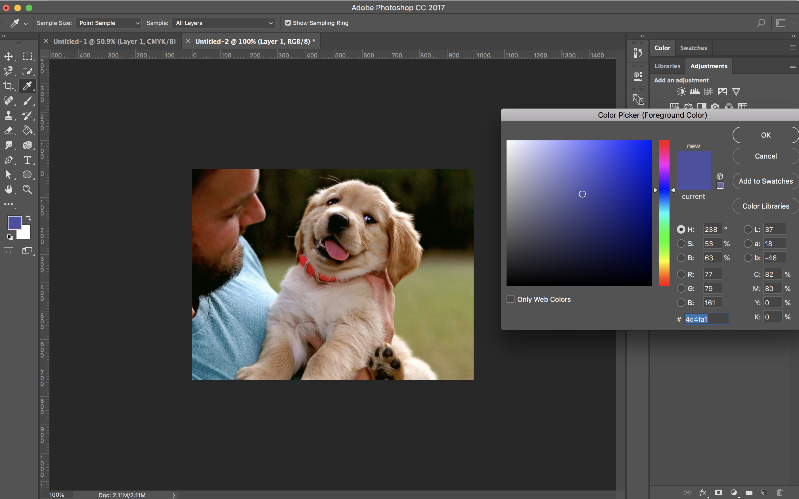
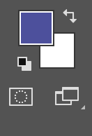

# Digital Art for Non-Majors

Wk11, Friday, 11/16/2018, Prof. Sheiva Rezvani

Course Site: http://bit.ly/NYU_F18 <-- Find attendance form here

**<u>Today's Outline:</u>**

-Intros

-Sign-in for attendance

-p5 Homework Lab

-REMINDER: No class next week

interested in finding a color's RGB value to insert it into your p5 sketch?  Use the color picker in Photoshop:

Close up of RGB values, right above the highlighted hex code:

Get to the color picker by clicking on the thumbnail for the foreground color

While the color picker is open use the automatic eyedropper to choose the color you want.  

Voila! You've got your RGB value!

